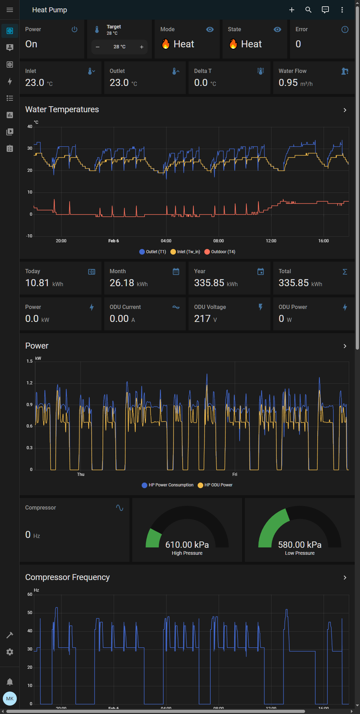

# Midea Heat Pump Modbus Integration for Home Assistant

Home Assistant integration for Midea M-Thermal Arctic R290 heat pumps via Modbus RTU over TCP.



## Hardware Setup

- **Heat Pump**: Midea Thermal Arctic R290 10kW
- **Modbus Gateway**: Elfin EW11-A (WiFi to RS-485 converter)
- **Home Assistant**: Running on Raspberry Pi 5 (Docker)

### Wiring

```
Heat Pump (Wired Controller) → EW11-A → WiFi → Home Assistant
         H1 (-) → A                              Modbus TCP
         H2 (+) → B
```

### EW11-A Configuration

- **Mode**: Modbus TCP to RTU gateway (NOT transparent TCP)
- **Baud Rate**: 9600
- **Data Bits**: 8
- **Parity**: None
- **Stop Bits**: 1
- **TCP Port**: 8899

For full EW11-A settings see:
- [Current STA mode settings](resources/ew11-sta-settings.md)
- [Hardened AP mode settings](resources/ew11-ap-settings.md)
- [Hardening plan](resources/ew11-hardening-plan.md)

### Modbus Settings

- **Slave Address**: Default is 1, this project uses 2 (configurable in HMI wired controller)
- **Protocol**: Modbus RTU

## Files

| File | Description |
|------|-------------|
| `configuration.yaml` | Home Assistant config with Modbus sensors, template sensors, utility meters |
| `heat_pump_dashboard.yaml` | Lovelace dashboard for heat pump monitoring |
| `heat_pump_package_target_control.yaml` | HA package with input_number, shell_command, automation for target temp |
| `set_target.py` | Python script to write target temperature (called by HA automation) |
| `scan_registers.py`* | Modbus register scanner with full documentation |
| `register_dump.txt`* | Complete register dump with values and descriptions |

*Utility/reference files - not needed for running.

## Home Assistant on Raspberry Pi

### Option A: Home Assistant OS (recommended for beginners)

The easiest way. Flash a ready-made image to your Pi's SD card:

1. Download the HA OS image for your Pi from https://www.home-assistant.io/installation/raspberrypi
2. Flash it to an SD card using [Balena Etcher](https://etcher.balena.io/) or Raspberry Pi Imager
3. Boot the Pi, then open `http://homeassistant.local:8123`

HA OS gives you automatic updates, the Add-on store, and backups out of the box. The downside is you can't run other software on the Pi - it's dedicated to Home Assistant.

Config directory: `/config/`

### Option B: Docker container (this project's setup)

More flexible - run HA alongside other software. Works on Raspberry Pi OS Lite (headless Debian, no desktop needed). All commands below are run on the Pi via SSH (`ssh user@<pi-ip>`).

Install Docker:

```bash
# Download and run Docker's official install script
curl -fsSL https://get.docker.com | sh

# Allow your user to run docker commands without sudo
sudo usermod -aG docker $USER
```

Log out and back in (or `newgrp docker`) for the group change to take effect.

Start the Home Assistant container:

```bash
# Create the config directory
sudo mkdir -p /root/homeassistant/config

# Start HA container
sudo docker run -d \
  --name home-assistant \
  --restart unless-stopped \       # auto-restart after power loss / reboot
  -v /root/homeassistant/config:/config \  # HA config stored on Pi's filesystem
  -v /etc/localtime:/etc/localtime:ro \    # sync timezone with Pi
  --network host \                 # use Pi's network directly (no port mapping needed)
  ghcr.io/home-assistant/home-assistant:stable
```

Home Assistant is now available at `http://<pi-ip>:8123`.

Useful commands:

```bash
sudo docker restart home-assistant  # restart after config changes
sudo docker logs home-assistant     # view HA logs
sudo docker ps                      # check if container is running
```

Config directory: `/root/homeassistant/config/`

## Installation

1. Copy files to your Home Assistant config directory (`/root/homeassistant/config/`)
2. Update IP address in `configuration.yaml` and Python scripts (default: 192.168.178.121)
3. Update Modbus slave address in configs if using default (1) instead of 2
4. Restart Home Assistant
5. Dashboard appears automatically in sidebar as "Heat Pump"

## Features

- Real-time monitoring: temperatures, pressures, compressor frequency, COP
- Power control via Modbus switch
- Target temperature adjustment with +/- buttons
- Energy tracking (daily/monthly/yearly)
- Historical graphs for temperatures, power, COP

## Register Documentation

### Registers Used

| Address | Name | Description |
|--------:|:-----|:------------|
|       2 | Set water temp T1s | Zone1 target (low byte), Zone2 (high byte) |
|      16 | Power Zone 1 | 0=off, 1=on (used as switch) |
|     100 | Compressor frequency | Current frequency in Hz, 0=off |
|     101 | Operating state | 0=off, 2=cooling active, 3=heating active |
|     104 | Tw_in | Water inlet (return) temperature |
|     105 | Tw_out | Water outlet (supply) temperature |
|     106 | T3 | Condenser refrigerant temperature |
|     107 | T4 | Outdoor ambient temperature |
|     108 | Tp | Compressor discharge (hot gas) temperature |
|     109 | Th | Compressor suction temperature |
|     110 | T1 | Total outlet water temperature |
|     116 | P1 | High-side refrigerant pressure (kPa) |
|     117 | P2 | Low-side refrigerant pressure (kPa) |
|     118 | ODU current | Outdoor unit current (x0.1 A) |
|     119 | ODU voltage | Outdoor unit supply voltage (V) |
|     124 | Current error | Error code, 0=no error |
|     138 | Water flow | Flow rate through heat exchanger (x0.01 m³/h) |
|     143 | Energy consumption high | Cumulative kWh, high 16 bits (x0.01) |
|     144 | Energy consumption low | Cumulative kWh, low 16 bits (x0.01) |
|     150 | Heating power | Real-time power consumption (x0.01 kW) |
|     151 | Heating COP | Real-time coefficient of performance (x0.01) |
|     199 | Operation mode | 0=Off, 2=Cool, 3=Heat, 5=DHW |

For the full register map (290 registers), see [register_dump.txt](register_dump.txt) or run:

```bash
python scan_registers.py
```

## Notes

- Bulk reads work for registers 0-22 and 100-199, but registers 200-290 must be read individually
- Negative temperatures use 16-bit two's complement (e.g., 65531 = -5°C)
- 32-bit values split across two registers: `(high * 65536 + low) / 100`

## References

- [Midea Modbus Protocol Documentation](resources/midea-modbus-protocol.pdf)
- [Elfin EW11 User Manual](resources/elfin-ew11-user-manual.pdf)

## License

MIT
